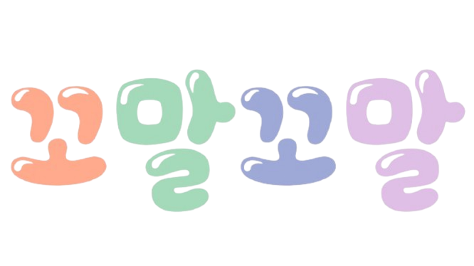
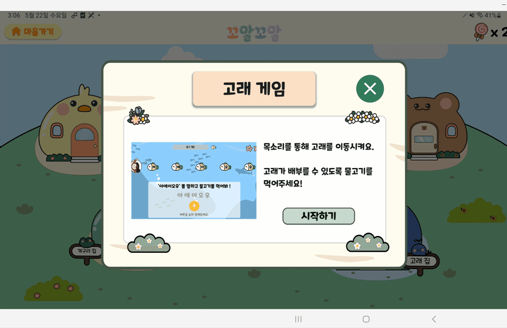
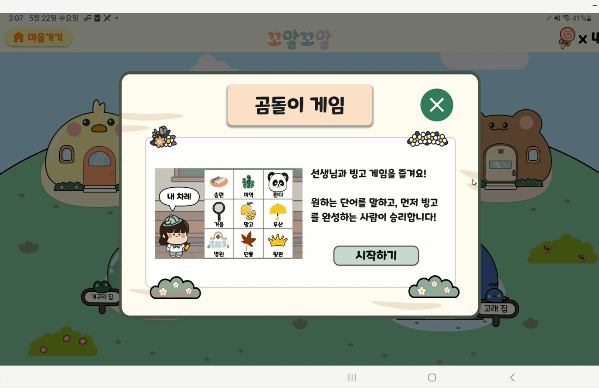
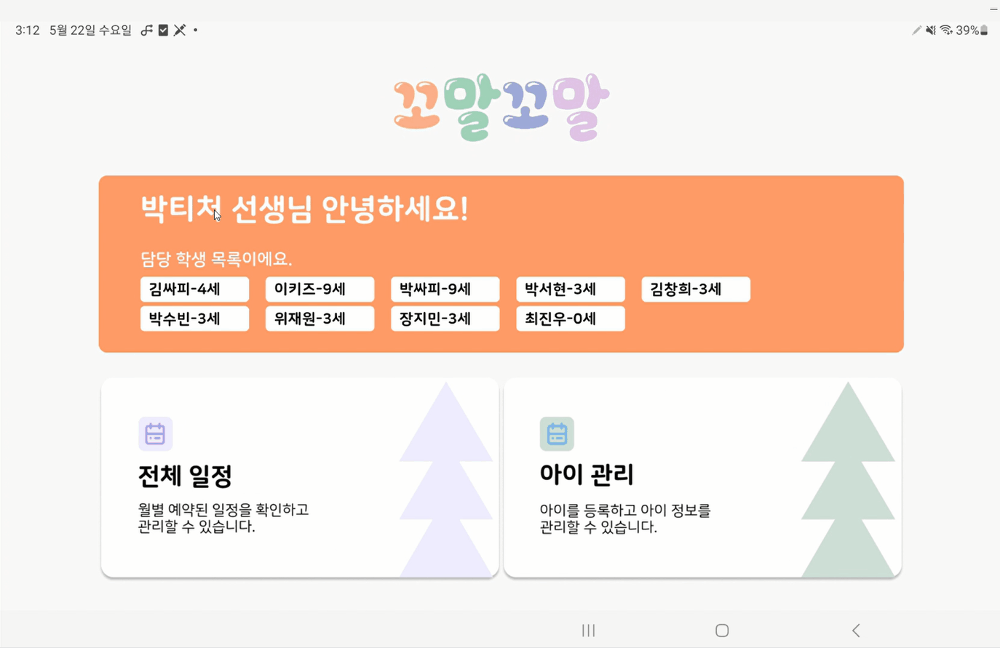
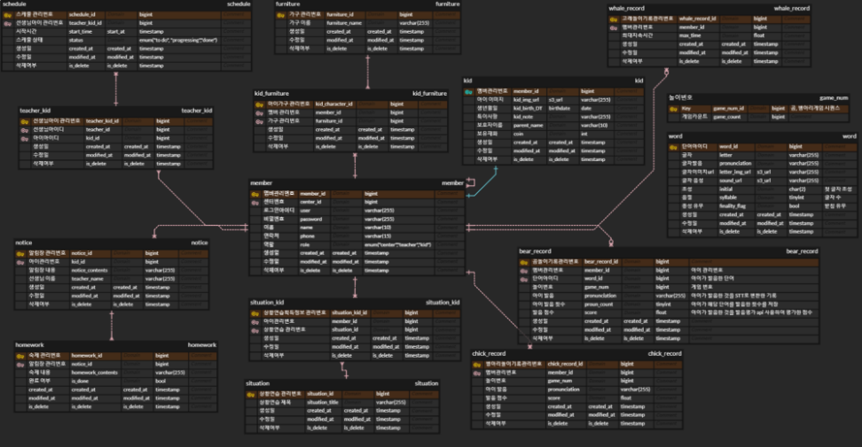
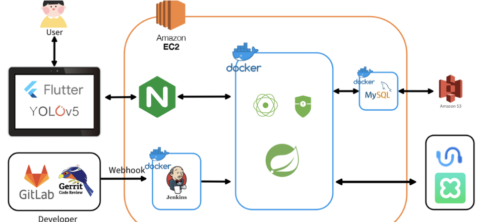

# 꼬말꼬말
### 꼬꼬마들이 말을 잘하는 세상

 

# 프로젝트 개요
✨SSAFY 10기 2학기 자율 프로젝트 - 우수상 (2위) 수상 ✨
2024.04.08 ~ 2024.05.20 (43일)

 

# 목차
[1. 기획 배경](#1-기획-배경)  
[2. 서비스 소개](#2-서비스-소개)  
[3. 주요 기능](#3-주요-기능)  
[4. 기술 차별점](#4-기술-차별점)  
[5. 기대 효과](#5-기대-효과)  
[6. 현업 전문가 피드백](#6-현업-전문가-피드백)  
[7. 개발 환경](#7-개발-환경)  
[8. ERD](#8-ERD)  
[9. 아키텍처](#9-아키텍처)  
[10. 협업환경](#10-협업환경)  
[11. 팀원 소개](#11-팀원-소개)  
[12. 산출물](#12-산출물)  
[13. 발표 자료](#13-발표-자료)  

 
 

# 1. 기획 배경
코로나 이후로 말이 늦는 아이들의 비율이 늘어났다는 기사, 보신 적 있나요? 

언어 나이와 실제 나이의 차이가 있는 경우를 **언어지연/언어장애**라고 합니다. 
이 아이들이 **언어치료**의 시기를 놓치게 된다면, 언어만이 아닌 다른 문제로까지 이어질 수 있습니다.

하지만 언어치료는 치료비용이 비싸고, 치료까지 대기가 길고, 가정에서의 훈련 병행이 어려운 등의 문제가 있습니다.

이를 해결하기 위한 고민 끝에 탄생한 프로젝트! 꼬말꼬말 소개합니다.
 
 
 

# 2. 서비스 소개

**모든 꼬꼬마들이 말을 잘하는 세상**을 꿈꾸는 
**언어장애 아동**을 위한 **놀이형 언어치료** 어플리케이션

**조음∙음운 장애**(발음이 정확히 안되는 증상)와 **언어발달 지연** 증상이 있는 아이들 대상으로 합니다. 
꼬말꼬말은 무발화에서 단어의 결합까지의 훈련 과정에 함께합니다.

꼬말꼬말의 기능들은 실제 언어치료사와의 지속적인 피드백을 통해 **전문성**을 바탕으로 개발되었습니다. 
또한, 저희 꼬말꼬말은 언어치료 **센터에서도 교보재로 활용**이 가능하도록 방향성을 잡았습니다.

아이가 지루한 훈련이 아닌, 더 재밌고 신나는 훈련을 하므로써 **가정에서도 훈련**을 지속하여 **효율적인 치료**를 하는 것을 목표로 합니다.
 
 
 

# 3. 주요 기능

꼬말꼬말은 아이/관리자 두 가지 모드가 있습니다.

### <아이 모드>

 
🐸 **개구리집**
- 목적 : 혀 근육 강화
- 실제 언어치료에서 혀 근육 발달을 위해 진행하는 혀 스트레칭을 게임으로 만들었습니다.
- 아이가 혀를 내밀때마다 AI가 인식하고 딸기를 먹습니다.
  

  

🐳 **고래집**
- 목적 : 교호운동을 통한 기초 단모음 (아, 에, 이, 오, 우) 학습
- 목표에 달성할 때까지 반복 학습을 통해 기초 모음을 발화합니다.
  

  

🐻 **곰집**
- 목적 : 초성 별 단어 발화, '순서'를 지키는 인지, 사회성 학습
- 언어 치료사 선생님과 함께하는 발화 빙고입니다.
- 선생님과 번갈아가며 화면의 단어를 선택하고 발음합니다.
- 단어 카드를 선택하면 해당하는 발음을 들을 수 있습니다.
- 아이가 정확하게 단어를 발음하면, 선생님이 통과 버튼을 눌러 빙고를 진행시킵니다.
  

  

🐣 **병아리집**
- 목적 : 두 단어 이상으로 구성된 문장 말하기
- 상황을 선택하면, 그에 맞는 문장이 선정됩니다.
- 언어치료사의 피드백을 받아 아이들이 평상시 자주 사용하는 어휘로 구성했습니다. (또래와 사용하는 반말, 실생활에 쓰이는 어휘 사용)
- 아이템을 선택하고 상황에 맞는 문장으로 발음합니다.
- 정확히 발음하면 상황이 진행되고, 완료시 보상을 획득합니다.
- 한 게임이 완료하면 다음 게임이 열리게 되어 수준에 맞는 게임 서비스를 제공합니다.
  

  

👩🏻 **나의 집**
- 아이의 흥미 유발을 위해 게임 성공할때마다 사탕이라는 보상을 줍니다.
- 사탕으로 집의 가구를 사서 채울 수 있습니다.
- 언어 자극, 상호작용을 위해 가구를 누르면 소리가 나오게 구성했습니다.
- 게임을 통해 발화한 모든 내용은 AI가 발음을 평가하여 학습 현황에서 수치화된 데이터로 제공합니다.
- 언어치료사가 남겨주는 알림장으로 아이에 대한 정보와 숙제를 열람할 수 있습니다.
  

  

### <관리자 모드>

📅 **수업 일정 관리**
- 언어치료사 선생님이 아이들의 수업 일정을 관리할 수 있습니다.
    

📊 **아이 학습현황**
- 아이가 게임으로 발화한 모든 내용을 AI가 발음을 평가합니다.
- 조음별, 날짜별, 단어별 발음을 평가한 점수 데이터를 그래프로 제공합니다.
    

📝 **알림장**
- 보호자에게 남기는 알림장입니다.
- 알림사항, 오늘의 숙제 등을 제공합니다.

 
 
 

# 4. 기술 차별점
### 1. AI 혀 객체 인식
Yolo 모델은 **단일 신경망 방식의 딥러닝 모델**로, 한번의 이미지 전달에 모든 객체를 탐지할 수 있습니다. 
빠른 응답속도 덕분에 **실시간 객체 검출**에 특히 활용도가 높습니다.

네트워크 연결이 없이 **On-device** 방식으로 구현하기 위해 'ONNX' 형식을 거쳐 'Tesorflow lite' 모델로 변환하였습니다.

높은 정확도와 응답속도로 혀를 인식하고 게임에 사용될 수 있었습니다.

### 2. AI CLOVA Speech Recognition
STT를 구현하는 외부 서비스입니다. 
REST API형태로 음성데이터를 보내고 문자로 응답받습니다.

곰 집, 병아리 집에 발음한 단어를 분석하는데 사용합니다.

API 요청은 사용자 응답 후에 시작되도록 설계하여, 응답속도를 개선할 수 있었습니다.

이후 변환된 text는 DB에 저장하여 통계로 활용됩니다.

### 3. AI Speechsuper
음절별 발음 정확도를 평가해주는 외부 서비스입니다. 
REST API형태로 음성데이터, 발음한 text를 보내고, JSON 형태의 발음 점수를 응답받습니다.

고래 집, 곰 집, 병아리 집에서 발음한 단어(문장)을 평가하는데 사용됩니다.

### 4. Web Socket
대상자와 지도자 간의 빙고 게임을 구현하기위해 Web socket 통신을 활용하였습니다.

빙고 게임은 작은 응답을 자주 호출해야 하는 환경이었고, 이 때 Web socket은 큰 장점을 가집니다. 
http 통신은 폴링을 기반으로 인증 절차를 거치고, 오버헤드가 발생합니다.

Webflux 환경에서 비동기적으로 구현하기위해 라이브러리 없이 Room과 handler를 구현하였습니다.

### 5. Web Flux
**제한된 스레드**에서 요청을 처리하는 Spring 기반의 Framework입니다. 
Netty를 기반으로 비동기적으로 동작하는 서버를 구성합니다.

서비스 특성상 게임을 진행하는 짧은시간동안 요청이 집중됩니다. 
요청마다 스레드를 할당하는 MVC와 달리 하나의 스레드에서 안정적인 응답을 구현하였습니다.

### 기술스택
 

`BACKEND` **|**
 

`FRONTEND-APP` **|**

`CI/CD` **|**

`SERVER` **|**

 
 
 

# 5. 기대 효과
- 센터에서의 교보재 활용
    - 언어치료사는 센터에서 1 : 1 수업으로 진행되고 선생님 1명당 담당하는 학생이 20명대입니다. 언어치료 특성상 목소리를 많이 내야함으로 교보재가 저희 꼬말꼬말 서비스로 대체된다면 이러한 불편한점이 개선될 수 있을 것 입니다.
- 치료 효과
    - 집에서도 부모님과 함께 꾸준히 훈련할 수 있습니다.
    - 전문가들과 지속적인 피드백을 통해 만들어 진 것이기에 전문성을 갖추고 있습니다.

 
 
 

# 6. 현업 전문가 피드백

 

저희 서비스는 위의 센터의 언어치료사와 부산가톨릭대학교 교수님과의 지속적인 피드백을 통해 개발되었습니다. 아래 내용은 언어치료사의 요구사항, 피드백을 받은 부분, 최종 완성된 서비스를 사용해본 후기를 담고 있습니다. 

### 요구사항
1. 구강 스트레칭을 재밌게 할 수 있게 게임으로 만들었으면 좋겠다.
2. 단어 + 명사를 결합해 특정한 상황에 대해 문장으로 말하는 연습을 할 수 있으면 좋겠다.
3. 언어 발달을 위한 훈련을 단계별로 하게끔 할 수 있었으면 좋겠다.
4. 단어를 말하기 이전에 기본 발음을 정확하게 말할 수 있도록 연습했으면 좋겠다.
5. 집에가서도 훈련을 할 수 있게끔 했으면 좋겠다. (숙제 기능)
6. 아이의 훈련 현황을 한눈에 볼 수 있었으면 좋겠다.

 

### 피드백 받은 부분
- 상황 연습을 할 때 아이들이 실생활에서 많이 쓰는 단어나 문장들로 구성했으면 좋겠다. -> 병아리 게임 문장 수정함
- 단어 이전에 발화훈련을 할때에 자음보다 단모음으로 훈련을 많이 하기 때문에 단모음으로 고래게임을 구성했으면 좋겠다. -> 고래게임 "아에이오우" 를 한 세트로 하여 구성함
- 개구리 게임에서 아이의 얼굴이 화면 전체적으로 나왔으면 좋겠다.
- 빙고게임에서 그림과 함께 단어가 나왔으면 좋겠다.

 

### 사용해본 후기
[UCC 영상](./assets/7/UCC_인터뷰.mp4)
 

 
 
 

# 7. 개발 환경
### Server

- AWS EC2

### CI/CD

- Ubuntu 20.04 LTS
- Nginx 1.18.0
- OpenSSL 1.1.1f
- Jenkins 2.455

### IDE

- Android Studio 2023.2.1 patch 1
- Visual Studio Code 1.85.1
- IntelliJ IDEA 2023.03.02 (Ultimate Edition)
- Terminus

### FE

- Flutter SDK 3.19.5
- React ^18.2.0
- vite ^5.2.0
- NodeJs 22.0.0
- Tailwindcss ^3.4.3

### BE

- Springboot 3.2.5
- MySQL 8.3.0
- Java 17

### UI/UX

- Figma

### 형상 / 이슈관리

- GitLab
- Jira
- Gerrit

### 커뮤니케이션

- Mattermost
- Notion
- Discord

### 기타 외부 Tools

- speechsuper
- clova tts
- clova voice
 
 
 

# 8. ERD

 
 
 

# 9. 아키텍처

 
 
 

# 10. 협업환경
### Git

- Git branch 전략을 세우고 이를 바탕으로 Git을 관리하였습니다.
- Git branch 전략

### Jira

- 월요일마다 스프린트 회의를 통해 한 주간의 목푤르 세우고 일정을 정리했습니다.
- 데일리 스크럼, 팀 회의, 개인 개발 일정 등 구체적인 일정을 세우고 계획하였습니다.

### Notion

- 프로젝트와 관련된 각종 문서, 정보, 문서, 기획서 등의 자료를 Notion을 통해 작성 및 관리하였습니다.

### Gerrit

- Gerrit을 통해 팀원들의 코드를 commit 단위로 리뷰하는 시간을 가졌습니다.
- 팀원 간 코드 리뷰를 통해 클린한 코드를 작성하고자 하였습니다.
 
 
 

# 11. 팀원 소개
 
 
 

# 12. 산출물

- [기능 정의서](./assets/13/기능정의서.pdf)
- [API 명세서](./assets/13/API명세서.pdf)
- [ERD]()
- [아키텍처]()
- [포팅매뉴얼](./assets/13/포팅매뉴얼.pdf)
- [Git Convention](./assets/13/gitbranch전략.pdf)
- [Gerrit 매뉴얼](./assets/13/gerrit매뉴얼.pdf)
 
 
 

# 13. 발표 자료
- [중간발표 PPT](./assets/14/꼬말꼬말_중간발표.pdf)
- [최종발표 PPT](./assets/14/꼬말꼬말_최종발표.pdf)
 
 
 

